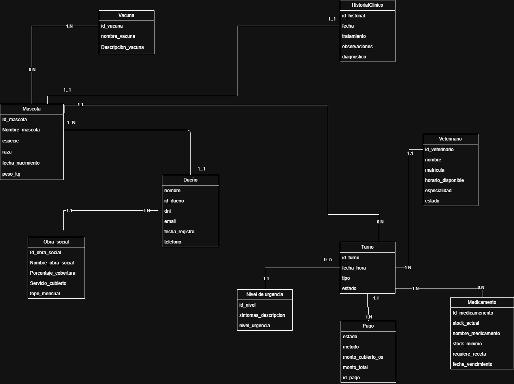

Clínica Veterinaria Automatizada

## Descripción del proyecto
El sistema de Clínica Veterinaria Automatizada es una aplicación de gestión integral para clínicas veterinarias que automatiza el proceso de atención al paciente de principio a fin. El sistema permite que el dueño de una mascota registre los síntomas de su animal, reciba una clasificación automática del nivel de urgencia y obtenga un turno asignado sin intervención manual. Durante la consulta, el veterinario registra el diagnóstico, prescribe medicamentos y programa el seguimiento. El sistema además gestiona el stock de medicamentos, el calendario de vacunación y los pagos con cobertura de obra social.
Objetivo principal: reducir la carga administrativa de la clínica y garantizar una atención ordenada, trazable y disponible las 24 horas.

## Modelo de Dominio

## Bosquejo de Arquitectura

Definir la arquitectura del sistema y como interactuan sus diferentes componentes. Utilizar el Paquete **Office** de Draw.io o similar. [Ejemplo Online]().

## Requerimientos

Definir los requerimientos del sistema.

### Funcionales

| ID | Descripción |
|---|---|
| RF01 | El sistema debe permitir registrar dueños y mascotas con sus datos básicos. |
| RF02 | El sistema debe permitir ingresar los síntomas de una mascota y determinar automáticamente su nivel de urgencia: emergencia, prioritario o programado. |
| RF03 | El sistema debe asignar un turno automáticamente según el nivel de urgencia y la disponibilidad del veterinario. |
| RF04 | El sistema debe permitir registrar el historial clínico de cada mascota por cada consulta (diagnóstico, tratamiento y observaciones). |
| RF05 | El sistema debe permitir prescribir medicamentos y descontar la cantidad del stock disponible. |
| RF06 | El sistema debe registrar las vacunas aplicadas a cada mascota y calcular la fecha de la próxima dosis. |
| RF07 | El sistema debe gestionar el pago de cada turno, calculando el monto final según la cobertura de obra social del dueño. |
| RF08 | El sistema debe alertar cuando el stock de un medicamento caiga por debajo del mínimo configurado. |

### No Funcionales

| ID | Descripción |
|---|---|
| RNF01 | El sistema debe funcionar en PCs con Windows 10 o superior como sistema operativo. |
| RNF02 | El sistema debe estar desarrollado utilizando Python 3.8 o superior. |
| RNF03 | El sistema debe utilizar una base de datos SQL para el almacenamiento de la información. |
| RNF04 | El sistema debe diseñarse con una arquitectura en 3 capas. |

### Portability

**Obligatorios**

- El sistema debe funcionar correctamente en múltiples navegadores (Sólo Web).
- El sistema debe ejecutarse desde un único archivo .py llamado app.py (Sólo Escritorio).

### Security

**Obligatorios**

- Todas las contraseñas deben guardarse con encriptado criptográfico (SHA o equivalente).
- Todas los Tokens / API Keys o similares no deben exponerse de manera pública.

### Maintainability

**Obligatorios**

- El sistema debe diseñarse con la arquitectura en 3 capas. (Ver [checklist_capas.md](checklist_capas.md))
- El sistema debe utilizar control de versiones mediante GIT.
- El sistema debe estar programado en Python 3.8 o superior.

### Reliability

### Scalability

**Obligatorios**

- El sistema debe funcionar desde una ventana normal y una de incógnito de manera independiente (Sólo Web).
  - Aclaración: No se debe guardar el usuario en una variable local, deben usarse Tokens, Cookies o similares.

### Performance

**Obligatorios**

- El sistema debe funcionar en un equipo hogareño estándar.

### Reusability

### Flexibility

**Obligatorios**

- El sistema debe utilizar una base de datos SQL o NoSQL

## Stack Tecnológico

Definir que tecnologías se van a utilizar en cada capa y una breve descripción sobre por qué se escogió esa tecnologia.

### Capa de Datos

Definir que base de datos, ORM y tecnologías se utilizaron y por qué.

### Capa de Negocio

Definir que librerías e integraciones con terceros se utilizaron y por qué. En caso de consumir APIs, definir cúales se usaron.

### Capa de Presentación

Definir que framework se utilizó y por qué.